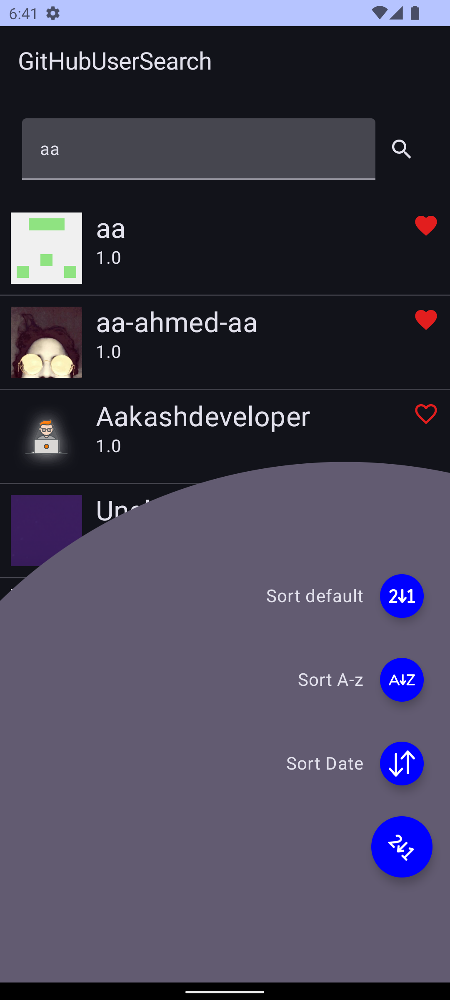
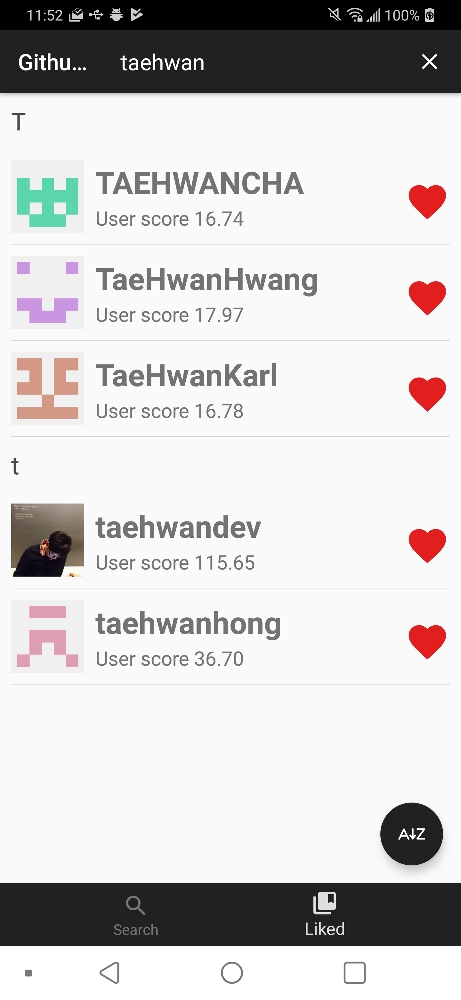

# GithubUserSearch

Use api Github [Sarch users](https://developer.github.com/v3/search/#search-users).

Using the Android AAC-ViewModel and my own [SimpleAdapter](https://github.com/taehwandev/GithubUserSearch/tree/master/baseadapter).
[GithubUserActivity](https://github.com/taehwandev/GithubUserSearch/blob/master/app/src/main/java/tech/thdev/githubusersearch/view/github/GithubUserActivity.kt) and [GithubUserFragment](https://github.com/taehwandev/GithubUserSearch/blob/master/app/src/main/java/tech/thdev/githubusersearch/view/github/GithubUserFragment.kt).

# Sample Page

| User search | User like and sort button. |
|:----------: | :----------: |
|   |  |

# Use Android API

- <a href="https://developer.android.com/topic/libraries/support-library/packages#v7-appcompat">android support appcompat-v7</a>
- <a href="https://developer.android.com/topic/libraries/support-library/packages#v7-recyclerview">android support recyclerview-v7</a>
- [android support constraint-layout](https://developer.android.com/training/constraint-layout/)
- [android lifecycle extensions](https://developer.android.com/topic/libraries/architecture/adding-components)
- <a href="https://developer.android.com/topic/libraries/architecture/adding-components#room">android room</a>
- [android kotlin ktx](https://developer.android.com/kotlin/ktx)
- [squareup retrofit2](http://square.github.io/retrofit/)
- [squareup retrofit2:adapter-rxjava2](https://github.com/square/retrofit/tree/master/retrofit-adapters/rxjava2)
- [squareup retrofit2:converter-gson](https://github.com/square/retrofit/tree/master/retrofit-converters/gson)
- [squareup okhttp3](https://github.com/square/okhttp)
- [squareup okhttp3:logging-interceptor](https://github.com/square/okhttp/tree/master/okhttp-logging-interceptor)
- [reactivex.rxjava2:rxandroid](https://github.com/ReactiveX/RxAndroid)
- [reactivex.rxjava2:rxjava](https://github.com/ReactiveX/RxJava)
- [junit:junit](https://developer.android.com/training/testing/junit-rules)

# Use Testing API

- [junit4](https://developer.android.com/training/testing/junit-rules)
- <a href="https://developer.android.com/topic/libraries/architecture/adding-components#room">android room test</a>
- [Mockito-Kotlin](https://github.com/nhaarman/mockito-kotlin)
- kotlin-test-junit


# License

```
Copyright 2018 Tae-hwan

Licensed under the Apache License, Version 2.0 (the "License");
you may not use this file except in compliance with the License.
You may obtain a copy of the License at

   http://www.apache.org/licenses/LICENSE-2.0

Unless required by applicable law or agreed to in writing, software
distributed under the License is distributed on an "AS IS" BASIS,
WITHOUT WARRANTIES OR CONDITIONS OF ANY KIND, either express or implied.
See the License for the specific language governing permissions and
limitations under the License.
```
