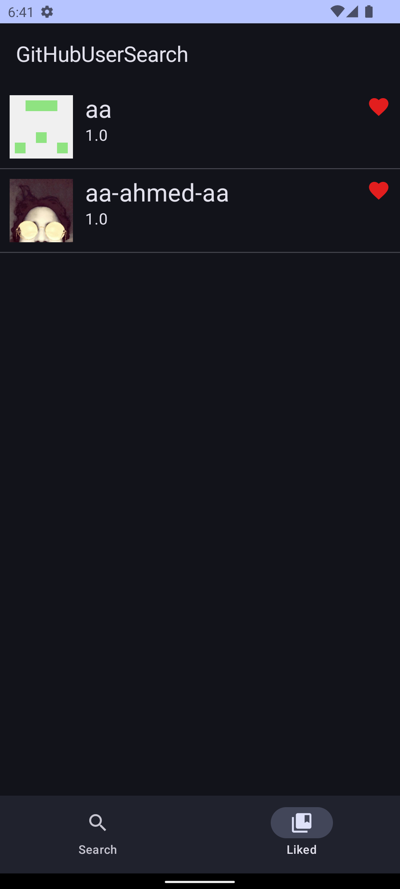

# GitHubUserSearch

Use api GitHub [GitHub search](https://docs.github.com/en/free-pro-team@latest/rest/search/search?apiVersion=2022-11-28#search-code).

# Sample Page

Search page and liked page

|           User search           |   User like and sort button.    |
|:-------------------------------:|:-------------------------------:|
|  |  |

# Sample list

|                              Sample name                               |                                                     link                                                     |
|:----------------------------------------------------------------------:|:------------------------------------------------------------------------------------------------------------:|
| Compose example. MVVM + Compose Navigation + coroutines example / Hilt |       [link](https://github.com/taehwandev/GithubUserSearch/tree/MVVM-Compose-Hilt-coroutines-sample)        |
|             MVVM + Navigation + coroutines example / Hilt              |           [link](https://github.com/taehwandev/GithubUserSearch/tree/MVVM-Hilt-coroutines-sample)            |
| MVVM + Navigation + coroutines example / Manual dependency injection.  | [link](https://github.com/taehwandev/GithubUserSearch/tree/MVVM-ManualDependencyInjection-coroutines-sample) |
|   MVVM + Navigation + RxJava example / Manual dependency injection.    | [link](https://github.com/taehwandev/GithubUserSearch/tree/MVVM-ManualDependencyInjection-coroutines-sample) |

# Android Architecture

MVVM patten and Use Hilt, Compose


# Use Library

all library info : [libs.versions.toml](gradle/libs.versions.toml)

- UI
    - Android compose navigation + compose
    - AAC-ViewModel
    - [Compose Floating](https://medium.com/@khambhaytajaydip/jetpack-compose-multiple-floatingactionbutton-2fe26f19404e)
    - [Compose keyboard controller](https://github.com/taehwandev/ComposeKeyboardState)
- async
    - Coroutines
- DI
    - Hilt
- Image loader
    - coil
- Test
    - Junit5
    - Coroutines test
    - Coroutines turbin
- Network
    - retrofit2
    - okhttp3

# License

```
Copyright 2018-2023 Tae-hwan

Licensed under the Apache License, Version 2.0 (the "License");
you may not use this file except in compliance with the License.
You may obtain a copy of the License at

   http://www.apache.org/licenses/LICENSE-2.0

Unless required by applicable law or agreed to in writing, software
distributed under the License is distributed on an "AS IS" BASIS,
WITHOUT WARRANTIES OR CONDITIONS OF ANY KIND, either express or implied.
See the License for the specific language governing permissions and
limitations under the License.
```